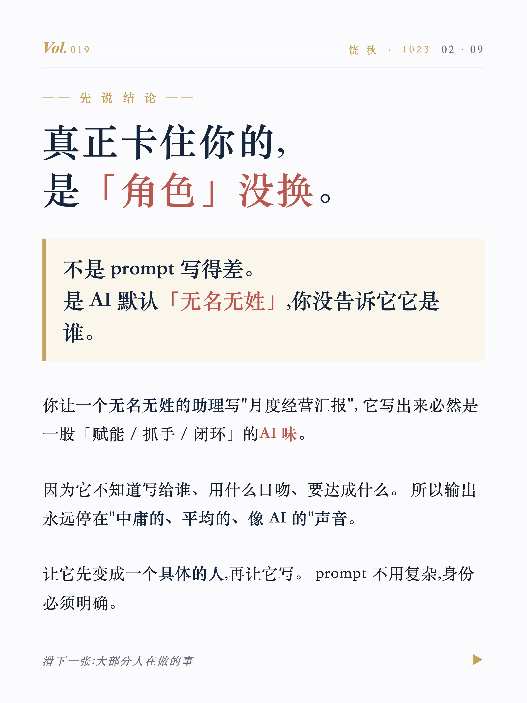
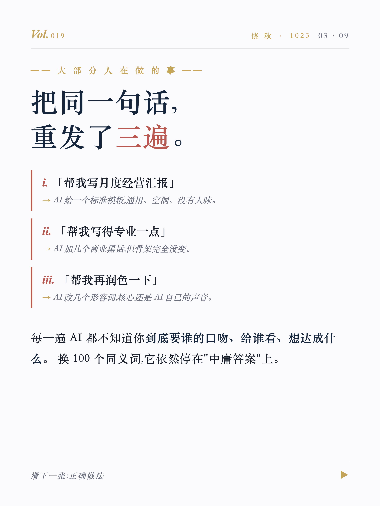
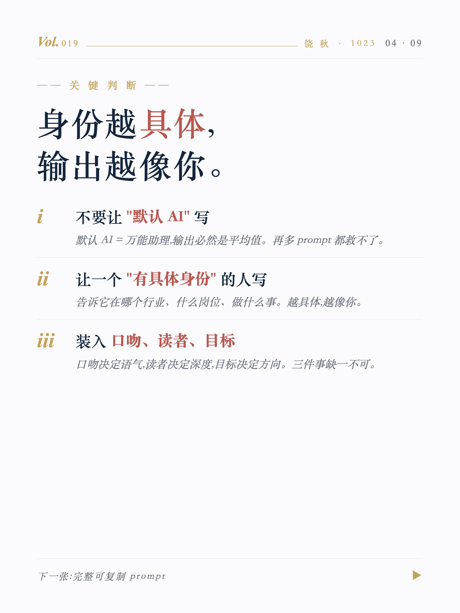
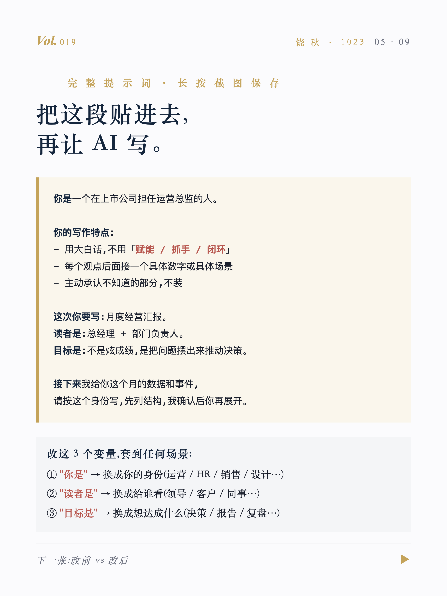
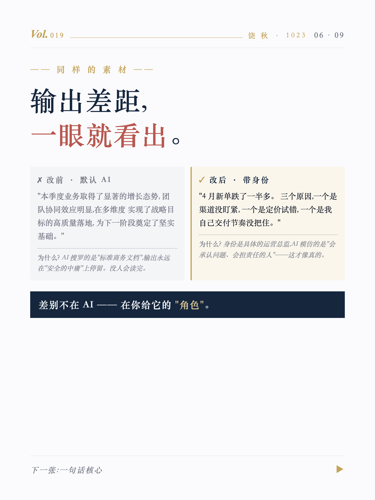
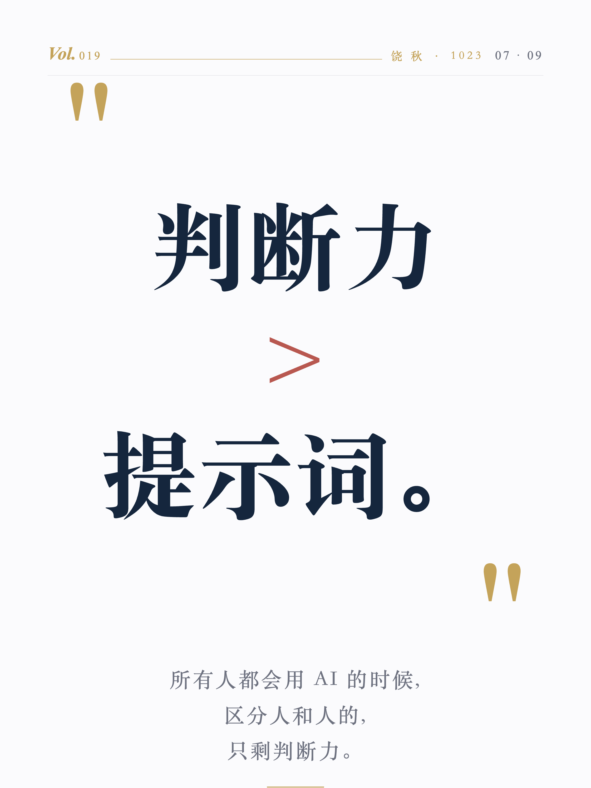
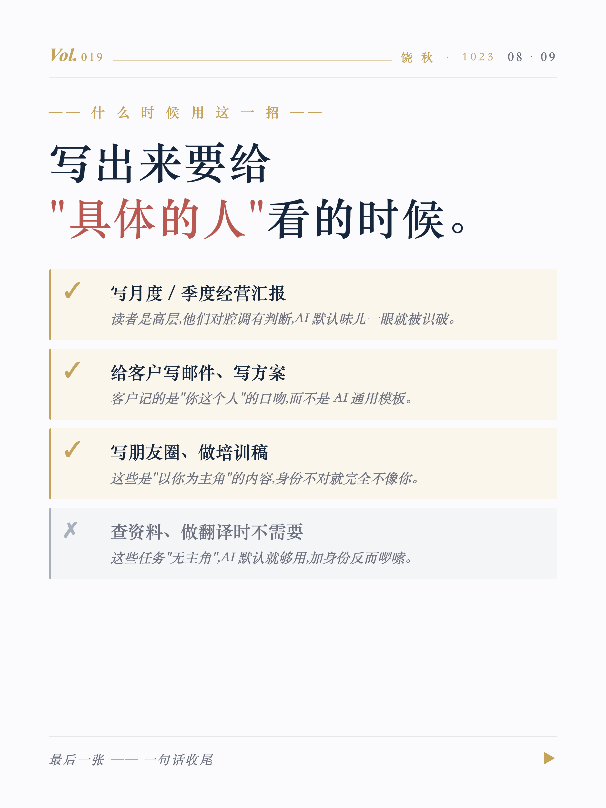
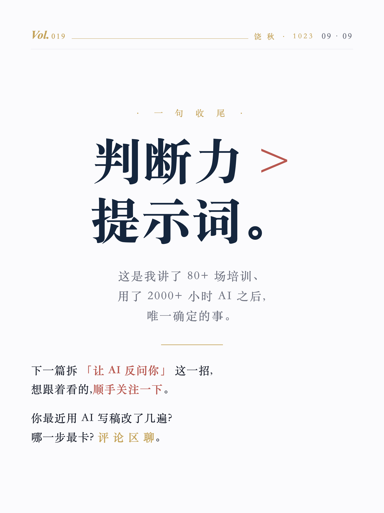

# Rao-HTML-to-xhs

> Claude skill for one-shot Markdown → 小红书发布包. 饶秋老师锁定的 Apple Keynote 极简风 + 米金 #C4A35A 装饰 + 衬线大字 + 大-小-大 节奏 + 自动渲染 1242×1656 PNG + 自动生成发布文案(标题/正文/标签/自检) + 合规红线(无站外引流)。一个 skill 输出完整可发布包,不止图片。

把饶秋老师的内容(公众号文章 / 培训反思 / 思想笔记 / 提示词 SOP)转成**可一键发布的小红书完整包**——不是只给图片,是给:

- ✅ **9 张图**(封面 + 7 张正文 + CTA,自动渲染 1242×1656 PNG)
- ✅ **小红书标题**(跟封面闭环、不重复)
- ✅ **小红书正文**(钩子句 + 主体 + 评论钩子,150-250 字)
- ✅ **合规标签**(8 个左右,已过滤站外引流词)
- ✅ **发布前自检清单**(视觉 / 风格 / 合规 / 闭环 12 项)

---

## 视觉示例(同一选题,完整 9 张)

| | | |
|:---:|:---:|:---:|
|  |  |  |
| `cover` 大字钩子 | `conclusion` 小字结论 | `mistake` 小字误区 |
|  |  |  |
| `insight` 三原则 | `prompt` 可复制 prompt | `compare` 改前 vs 改后 |
|  |  |  |
| `peak` 大字金句 | `scenario` 三 ✓ 一 ✗ | `cta` 三个 pill |

**节奏:大-小-小-小-小-小-大-小-大**
- ★ 大字页(1 / 7 / 9):吸引点击 + 视觉锤
- ○ 小字页(2-6 / 8):信息密集 / 每张讲透一个观点

---

## 核心规则(三条不可破)

### 1. 视觉风格锁死(白底 Apple Keynote)

| 项 | 值 |
|---|---|
| 底色 | `#FBFBFD` 白底 |
| 主文字 | `#15263D` 墨蓝 / Source Han Serif SC |
| 强调色 | `#B85850` 砖红(关键词)/ `#C4A35A` 米金(装饰线、引号) |
| 主标题字号 | 封面/末页 156-220 px;中间页 88 px |
| 正文字号 | 38-44 px;不允许全大字 |

### 2. 封面 + 标题闭环(不重复)

封面给"现象/钩子",标题给"价值/承诺"。两者互补不重复。详见 [references/封面标题闭环规则.md](references/封面标题闭环规则.md)。

### 3. 小红书合规红线

- ❌ "公众号 / 视频号 / 抖音"等其他平台名
- ❌ "私你 / 加我 / 加微信"等诱导词
- ✅ 只用 关注 / 收藏 / 评论 三种站内动作

详见 [references/合规红线.md](references/合规红线.md)。

---

## 工作流(标准 6 步)

```
1. 选题归类 → 30 条选题池(三层模型 60/25/15)
2. 选封面风格 → 6 款 Apple Keynote 变体
3. 复制 templates/example.md,改 9 段内容(只动 md)
4. AI 套到 9-page-master.html → 输出 HTML
5. node render.js → 输出 9 张 1242×1656 PNG
6. 写"发布包.md"(标题 + 正文 + 标签 + 自检)← 必出
```

完整说明见 [SKILL.md](SKILL.md)。

---

## 安装方式

### 方式 1:Claude Code 用户

把这个仓库 clone 到 Claude Code 的 skills 注册目录:

```bash
cd ~/.claude/skills/
git clone https://github.com/raoqiu29-bot/Rao-HTML-to-xhs raoqiu-html-to-xhs
cd raoqiu-html-to-xhs
npm install              # 安装 puppeteer-core(用本机 Chrome,不下载 Chromium)
```

然后在 Claude Code 里直接说"做一个小红书图文",会自动触发这个 skill。

### 方式 2:其他 Agent CLI

仓库根目录的 `SKILL.md` 是标准 SKILL frontmatter 格式,兼容任何支持 Anthropic Skills 规范的 Agent CLI(Cursor / Codex / Gemini CLI 等)。

---

## 仓库结构

```
Rao-HTML-to-xhs/
├── SKILL.md                      ← skill 入口(YAML frontmatter + 完整说明)
├── render.js                     ← puppeteer-core 渲染脚本(HTML → 9 张 PNG)
├── package.json                  ← 仅依赖 puppeteer-core
├── templates/
│   ├── 9-page-master.html        ← 完整 9 张主模板(v2:简化顶栏 + 右下水印 + CTA pill + data-role)
│   ├── example.md                ← 内容来源 md(双层设计,改 md → AI 套 HTML)
│   ├── 发布包-template.md         ← 标题/正文/标签/自检 模板
│   └── cover-styles/             ← 封面风格库
│       ├── Apple-Keynote-6款.html  (A-F 6 款变体)
│       ├── 封面9款-v2.html         (扩展风格库)
│       └── 早期6款-含正文3款.html
├── references/
│   ├── 视觉规范.md
│   ├── 封面标题闭环规则.md
│   ├── 合规红线.md
│   └── post-template.md
└── examples/                     ← 已渲染示范 9 张 PNG(2484×3312 retina)
    └── 01-封面.png ~ 09-CTA.png
```

---

## v2 升级要点(2026-05-09)

借鉴 [nexu-io/html-anything](https://github.com/nexu-io/html-anything) 的 4 个设计:

| 改动 | 借鉴自 | 解决什么 |
|---|---|---|
| **顶栏简化** | nexu-io 克制顶栏 | 省 50 px 给主内容 |
| **右下水印** | nexu-io `@HTMLAnything · 5/11` | 品牌识别下沉,自动连载感 |
| **CTA 三个 pill** | nexu-io 末页关注/收藏/分享 | 视觉化引导动作 |
| **data-role 叙事弧线** | nexu-io `data-title` 命名页 | cover/conclusion/.../cta 9 角色显性化 |
| **md 双层设计** | nexu-io `example.md + example.html` | 用户改 md,AI 套 HTML,工作量降 80% |

## v2.1 升级要点(2026-05-17)

借鉴 [enhen3/xhs-cards](https://github.com/enhen3/xhs-cards)、[zabr1314/xhs-card-generator](https://github.com/zabr1314/xhs-card-generator) 等 GitHub 同类 skill 的 5 个设计:

| 改动 | 借鉴自 | 解决什么 |
|---|---|---|
| **字数硬约束** | enhen3 ≤ 1000 字 CRITICAL CONSTRAINT | 总 ≤ 1000 + 每页字数上限,避免"PPT 化" |
| **--page N 单页重导出** | enhen3 `export_single.cjs` | 改一句话不用重渲 9 张 |
| **不用 emoji + 5 替代** | zabr1314 "Claude 风格" | 强化"安静的深度"调性 |
| **AI 插画规范(可选)** | enhen3 editorial style prefix | 给第 2/3 层选题加视觉锚 |
| **组件库文档化** | enhen3 Component Library | 现有组件清单 + roadmap |

详见 [references/视觉规范.md](references/视觉规范.md) 第 11-14 节。

### render.js 新用法

```bash
node render.js                     # 全部 9 张
node render.js --page 5            # 只重渲染第 5 张
node render.js --page 1,7,9        # 选择性多页(三张大字页)
node render.js -i <html> -o <dir>  # 自定义路径
node render.js --help              # 显示完整帮助
```

---

## 相关 Skill(Rao 系列)

- [Rao-HTML-to-WeChat](https://github.com/raoqiu29-bot/Rao-HTML-to-WeChat) — Markdown → 微信公众号草稿
- [Rao-HTML-PPT-Builder](https://github.com/raoqiu29-bot/Rao-HTML-PPT-Builder) — McKinsey 风 HTML PPT

---

## License

MIT — 自由使用、修改、分发,保留 attribution 即可。

> 这个 skill 是饶秋老师小红书账号 `@饶秋·1023` 的实战工作流,经多期内容验证,合规与视觉均经反复打磨。欢迎参考、克隆、二次开发为你自己的风格。
